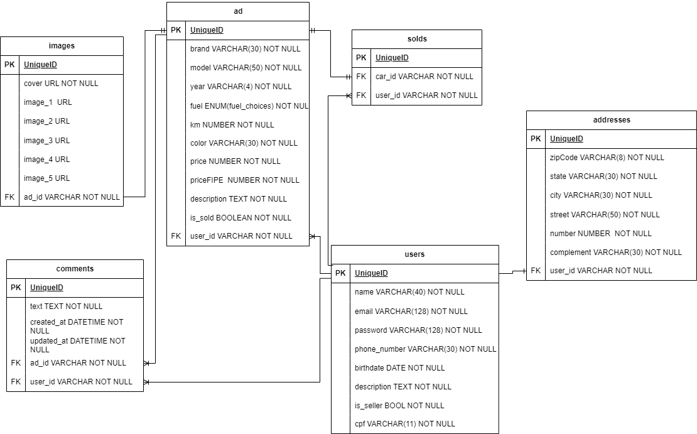

## Motor Shop API

## Content Table

- [Description](#1-description)
- [Diagrama ER](#2-diagrama-er)
- [Install dependencies](#3-install-dependencies)
- [Environment variables](#4-environment-variables)
- [Migrations](#5-migrations)
- [Running app](#6-running-app)
- [Documentation](#7-documentation)
- [Deploy URL](#8-deploy-url)

## 1. Description

[ Roll to top ](#content-table)

[Nest](https://github.com/nestjs/nest) framework TypeScript starter repository.

## 2. ER Diagram 

[ Roll to top ](#content-table)

API ER diagram displaying table relationship in database.



---

## 3. Install depedencies

[ Roll to top ](#content-table)

Clone the project in your advice and install the dependencies:

```bash
$ npm install
```

### 4. Environment variables

[ Roll to top ](#content-table)

Then, create a **.env** file, according to **.env.example** file:

```
cp .env.example .env
```
Set your environment variables with Postgres credentials, choose a new database and define secret key.

## 5. Migrations

[ Roll to top ](#content-table)

Execute migrations:

```bash
$ npx prisma migrate dev
```

## 6.Running app

[ Roll to top ](#content-table)

Bash commands to run the application:

```bash
# development
$ npm run start

# watch mode
$ npm run start:dev

# production mode
$ npm run start:prod
```

## 7. Documentation
[ Roll to top ](#content-table)

Motor Shop API documentation - (http://localhost:3001/api/)
Doc endpoint - (' ./api ')

## 8. Deploy URL
[ Roll to top ](#content-table)

Motor Shop URL in Render - (https://motor-shop-vglo.onrender.com)
